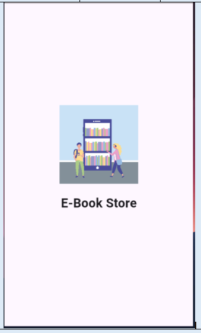

# ebook
## Overview  
The **E-Book App** is a Flutter application designed to provide a seamless reading experience with features like a splash screen, home and details page, search functionality, and category-based exploration. The project adopts a clean code approach and utilizes the **MVVM Architecture** for better code maintainability and scalability.

##  E_book App Mockup

### Features:

1. **Splash Screens**
   
   

2. **Home and Details Feature**  
   
   

3. **Search and Category Screens**  

  

---

## Packages Used in the Project  

- [provider](https://pub.dev/packages/provider): State management library for dependency injection and rebuilding UI.  
- [http](https://pub.dev/packages/http): Simplifies HTTP requests and responses in Dart applications.  
- [url_launcher](https://pub.dev/packages/url_launcher):   
- [readmore](https://pub.dev/packages/readmore): Provides functionality to expand and collapse lengthy text content.  
- [google_fonts](https://pub.dev/packages/google_fonts): Allows using Google Fonts to enhance the app's typography.  

---

## Project Highlights  

- **Clean Code**: Best practices are followed in Flutter development to ensure readability and maintainability.  
- **MVVM Architecture**: Organizing code into layers—Model, View, and ViewModel—to make the application scalable and manageable.  